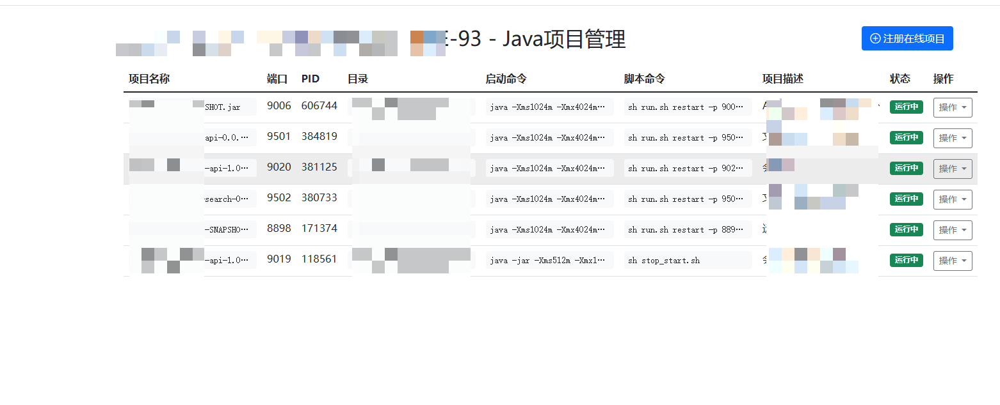

# 目录说明
## 其他项目
> 由于历史原因我懒得分开那么开了
1. [gateway目录是网关项目](./gateway/README.md)
2. [tools是一个工具集项目](./tools/README.md)
## omniscient目录是主项目
| 目录/文件名称       | 说明                | 描述                                                                 |
|---------------------|---------------------|----------------------------------------------------------------------|
| **api**             | 对外接口            | 对外提供服务的输入/输出数据结构定义。考虑到版本管理需要，往往以 `api/xxx/v1...` 存在。 |
| **hack**            | 工具脚本            | 存放项目开发工具、脚本等内容（如 CLI 工具配置、shell/bat 脚本等）。               |
| **internal**        | 内部逻辑            | 业务逻辑存放目录（通过 Golang internal 特性对外部隐藏可见性）。                  |
| ├─ cmd              | 入口指令            | 命令行管理目录，可维护多个命令行。                                               |
| ├─ consts           | 常量定义            | 项目所有常量定义。                                                             |
| ├─ controller       | 接口处理            | 接收/解析用户输入参数的入口/接口层。                                            |
| ├─ dao              | 数据访问            | 数据访问对象（抽象层），仅包含最基础的 CRUD 方法。                                |
| ├─ model            | 结构模型            | 数据结构管理模块，管理数据实体对象及输入/输出数据结构。                            |
| │  ├─ do            | 领域对象            | 用于 dao 数据操作中的业务模型与实例模型转换（由工具维护，用户不可修改）。            |
| │  └─ entity        | 数据模型            | 数据模型与数据集合的一对一关系（由工具维护，用户不可修改）。                        |
| └─ service          | 业务实现            | 业务逻辑的具体实现和封装（项目中最复杂的部分）。                                   |
| **manifest**        | 交付清单            | 程序编译、部署、运行、配置的相关文件。                                           |
| ├─ config           | 配置管理            | 配置文件存放目录。                                                            |
| ├─ docker           | 镜像文件            | Docker 镜像相关依赖文件及脚本。                                                |
| ├─ deploy           | 部署文件            | 部署相关文件（默认提供 Kubernetes 的 Yaml 模板，通过 kustomize 管理）。          |
| └─ protobuf         | 协议文件            | GRPC 使用的 protobuf 协议定义文件（编译后生成 go 文件到 api 目录）。              |
| **resource**        | 静态资源            | 静态资源文件（可通过资源打包/镜像编译注入到发布文件中）。                           |
| **go.mod**          | 依赖管理            | Go Module 包管理的依赖描述文件。                                               |
| **main.go**         | 入口文件            | 程序入口文件。                                                                |


# 如何使用编译文件
> 1. chmod +x ./omniscient
> 2. 使用 sudo 运行，要不然install 和 uninsatll会不剩下
> 3. 默认使用当前目录下的`config.prod.yaml`配置文件
> 4. 修改配置之后请 `./omniscient sh reload` 重新加载配置文件
> 5. 安装好之后请使用 `sudo omniscient sh enable` 启用开机自启
> 6. 查看自启状态请使用 `sudo omniscient sh status` ` Loaded: loaded (/etc/systemd/system/omniscient.service; disabled; preset: enabled)`
```shell
USAGE
    omniscient [command] [arguments]

COMMAND
    run    run the http server
    sh     service management shell commands

DESCRIPTION
    Omniscient is a web service with comprehensive management capabilities.
    Available Commands:
    run      - Run the HTTP server (default)
    sh       - Usage: sudo omniscient sh <command> (Service management shell commands)
    Examples:
    omniscient              # Run the server (default)
    omniscient run          # Run the server explicitly
    omniscient sh status    # Show service status
    omniscient sh install   # Install systemd service
    omniscient sh uninstall # uninstall systemd service
    omniscient sh enable    # Enable auto-start
    omniscient sh disable   # Disable auto-start
    omniscient sh start     # Start service
    omniscient sh stop      # stop service
    omniscient sh reload    # reload service
    omniscient sh restart   # restart service
    omniscient sh config [file] # Set default config file or show current config
```


# 环境
> https://goframe.org.cn/docs/cli/install
```shell
# go version 
go version go1.24.2 windows/amd64
# gf version
v2.9.0
```
# 已经测过的环境
- ubuntu 22.04
- CentOS Linux release 7.9.2009 (Core)


# 数据库
1. run [schema.sql](doc/schema.sql)
2. run [table.sql](doc/table.sql)

# run
- `gf run main.go`
- `go run main.go`

# web
1. [项目管理页面](http://127.0.0.1:8000/html/pm.html)
> title 规则 ： Hostname+IP地址的最后一段


2. [接口文档](http://127.0.0.1:8000/swagger/#tag/Java)


# test
1. 构建一个jar web 
2. 在ubuntu中启动 jar
3. 访问项目管理页面
4. 点击注册
5. 开始使用

# build
> 1. https://www.bilibili.com/video/BV1Uu4y1u7kX?spm_id_from=333.788.videopod.episodes&vd_source=6a1f4a95d77312275ea86329958a172f&p=46
> 2. https://goframe.org.cn/docs/cli/build
## 打包命令
打包配置信息在[config.yaml](hack/config.yaml)
> - system = linux,darwin,windows
> - arch = 386,amd64,arm,arm64 [uname -s/uname -m]
>   - ps: amd64 = x86_64
>   https://juejin.cn/post/7097032561092165640
```shell
gf build
```
## 使用命令
./omniscient sh 查看详情

## 直接运行命令
1. 指定配置文件`./omniscient run --gf.gcfg.file=./config.prod.yaml`
2. 直接运行`./omniscient run` 默认会加载当前目录下`config.prod.yaml`配置文件[如果当前没有会加载内置的配置文件]
3. 后台运行请看启动脚本

## 启动脚本
1. 查看进程`ps -ef | grep  omniscient`
2. 随编译文件构建一个配置文件使用`--gf.gcfg.file`即修改内部配置文件，如下：
> config.prod.yaml 参考[config.yaml](manifest/config/config.yaml)
```shell
#!/bin/bash

# 定义端口号
PORT=8001

# 根据端口号查找进程并获取 PID
PID=$(ss -tlnp | grep ":${PORT}" | awk '{print $6}' | cut -d',' -f2 | cut -d'=' -f2 | sort -u)

if [ -n "$PID" ]; then
    echo "Killing process $PID"
    kill -9 $PID
else
    echo "No process found on port $PORT"
fi

# 赋予 ./omniscient 文件可执行权限
chmod +x ./omniscient

# 执行 nohup ./omniscient --gf.gcfg.file=./config.prod.yaml > nohup.log 2>&1 & 进行部署
nohup ./omniscient --gf.gcfg.file=./config.prod.yaml > nohup.log 2>&1 &

# 获取新启动的进程 PID
NEW_PID=$!

echo "Deployment completed! PID: $NEW_PID, PORT: $PORT"
```


# 问题注意
## docker 启动的java会造成干扰
会抓取到docker启动jar程序，但是获取的目录是docker内部的，这里需要注意一下，docker的进程不要手贱去操作了
```shell
# 使用这个查看抓取的 java进程 是不是就是docker的，
docker top <容器名称或ID>
# 查看映射
docker inspect --format '{{json .Mounts}}' <容器名或ID>
```