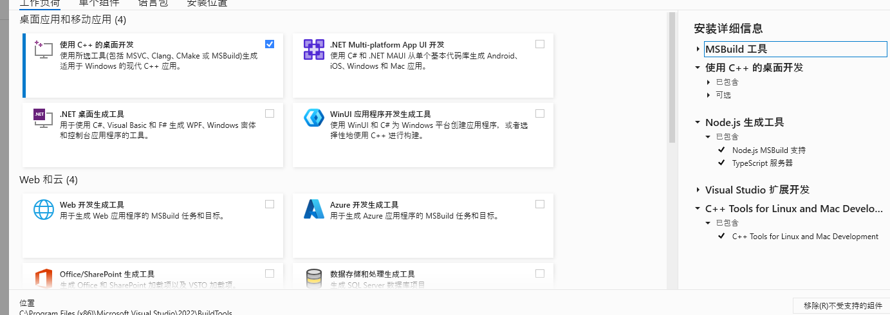

# 聚合html
ps: 用的浏览器缓存，缓存被删就没了更换浏览器也没了

1. 在不干扰原本单个服务使用的同时将多个`omniscient` 服务聚合在一起显示
2. docker https://hub.docker.com/r/tannnn/omniscient-gateway

# init 

## 运行数据库脚本
```shell
cd gateway
# db:docker是用来dockerfile用的，其他地方不要使用
node scripts/setup-db.js 
# or
npm run db:setup

```

## sqlite3 安装问题
> npm install 失败
> 删掉lock文件、node_modules
1. [安装 Visual Studio 及 C++ 工具链](https://visualstudio.microsoft.com/zh-hans/visual-cpp-build-tools/)
我也不知道按了那些了，反正就是错了就看日志然后安
 

2. 安装 Python
3. 安装 windows-build-tools
```shell
# 不想手动安装 Visual Studio 和 Python，可以使用 windows-build-tools 来自动安装
npm install --g --production windows-build-tools
```
4. 清理 npm 缓存并重新安装
```shell
npm cache clean --force
npm install
```

# use

## script
```bash
# dir
cd gateway
# install
npm install
# run
npm run dev
```
## access url
http://127.0.0.1:3000

# 环境
```shell
# react
^19.0.0
# next
15.3.2
# node -v
v20.9.0  or  v22.14.0  
# npm -v
10.1.0
```

# 文档
1. [Deploy now](https://vercel.com/new?utm_source=create-next-app&utm_medium=appdir-template-tw&utm_campaign=create-next-app)
2. [Read our docs](https://nextjs.org/docs?utm_source=create-next-app&utm_medium=appdir-template-tw&utm_campaign=create-next-app)
3. [Learn](https://nextjs.org/learn?utm_source=create-next-app&utm_medium=appdir-template-tw&utm_campaign=create-next-app)
4. [Examples](https://vercel.com/templates?framework=next.js&utm_source=create-next-app&utm_medium=appdir-template-tw&utm_campaign=create-next-app)

# 项目结构
> https://nextjs.org/docs/app/getting-started/project-structure
```text
gateway/
├── public/  # 静态资源
│   ├── css/
│   ├── js/
├── src/  # 应用程序源文件夹
│   ├── app/  # 应用路由器
└── package.json
```

# 样式参考
https://github.com/HumeAI/hume-evi-next-js-starter
